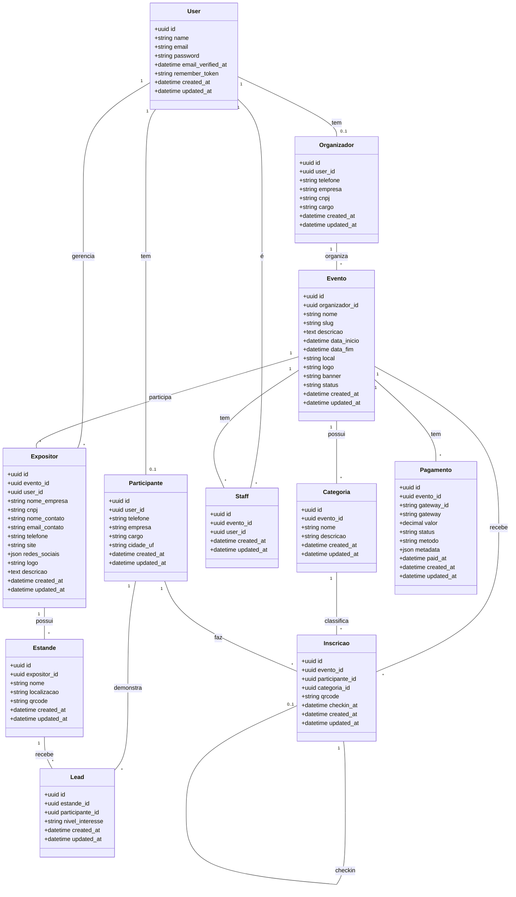

# Modelo de Dados - BizzExpo

**Versão:** MVP (Milestone 1)
**Última atualização:** 2026-03-07

---

## Diagrama de Classes

---

## Descrição das Entidades

### User
Entidade base de autenticação. Todos os perfis (organizador, participante, staff, expositor) são vinculados a um User.

### Organizador
Pessoa ou empresa que contrata a plataforma e cria eventos. Relacionado 1:1 com User.

### Participante
Pessoa que se inscreve em eventos. Relacionado 1:1 com User. Pode se inscrever em múltiplos eventos.

### Evento
Feira, exposição ou congresso criado por um organizador. Possui status: `rascunho`, `pago`, `publicado`, `encerrado`.

### Categoria
Segmentação de participantes dentro de um evento (ex: Visitante, Comprador, Imprensa, VIP).

### Staff
Equipe de apoio vinculada a um evento específico. Realiza check-in e cadastro walk-in.

### Expositor
Empresa que participa de um evento com estandes. Vinculado a um evento específico e gerenciado por um User.

### Estande
Ponto de presença física do expositor no evento. Possui QR Code único para captura de leads.

### Inscricao
Registro de participante em evento. Possui QR Code para check-in e registro de data/hora do check-in.

### Lead
Registro de interesse de participante em expositor. Criado quando participante escaneia QR Code do estande.

### Pagamento
Registro de pagamento do organizador para publicar evento. Integração com Pagar.me.

---

## Enums

### EventoStatus
- `rascunho` - Evento criado, não pago
- `pago` - Pagamento confirmado
- `publicado` - Landing page ativa, inscrições abertas
- `encerrado` - Evento finalizado

### NivelInteresse
- `orcamento` - Quero orçamento
- `profissional` - Sou profissional da área
- `entusiasta` - Sou entusiasta
- `conhecendo` - Apenas conhecendo

### PagamentoStatus
- `pendente` - Aguardando pagamento
- `processando` - Em processamento
- `pago` - Confirmado
- `falhou` - Falha no pagamento
- `estornado` - Estornado

### PagamentoMetodo
- `credit_card` - Cartão de crédito
- `debit_card` - Cartão de débito
- `pix` - PIX

---

## Índices Recomendados

| Tabela | Colunas | Tipo |
|--------|---------|------|
| eventos | organizador_id | INDEX |
| eventos | slug | UNIQUE |
| eventos | status | INDEX |
| categorias | evento_id | INDEX |
| expositores | evento_id | INDEX |
| expositores | user_id | INDEX |
| estandes | expositor_id | INDEX |
| estandes | qrcode | UNIQUE |
| inscricoes | evento_id, participante_id | UNIQUE |
| inscricoes | qrcode | UNIQUE |
| inscricoes | categoria_id | INDEX |
| leads | estande_id, participante_id | UNIQUE |
| staff | evento_id, user_id | UNIQUE |
| pagamentos | evento_id | INDEX |

---

## Considerações

### Multi-tenancy
- Implementado via coluna `organizador_id` nas tabelas relacionadas
- Scope global aplicado automaticamente via trait `HasOrganizador`

### Soft Deletes
Aplicar soft delete em:
- Evento
- Expositor
- Estande
- Inscricao

### UUIDs
Todas as tabelas usam UUID como chave primária para:
- Evitar exposição de IDs sequenciais
- Facilitar sincronização futura (offline)
- Maior segurança

### Auditoria
Considerar implementação de audit log para:
- Alterações em Evento
- Alterações de status
- Ações de pagamento
