# Modelo de Dados - BizzExpo

**Versao:** 0.7.0
**Ultima atualizacao:** 2026-04-08

---

## Diagrama de Classes

```mermaid
classDiagram
    direction TB

    %% ==========================================
    %% AUTENTICACAO E USUARIOS
    %% ==========================================

    class User {
        +uuid id
        +string name
        +string email
        +string password
        +datetime email_verified_at
        +string remember_token
        +datetime created_at
        +datetime updated_at
    }

    class Pessoa {
        +uuid id
        +uuid user_id
        +uuid documento_id
        +uuid created_by
        +TipoPessoa tipo
        +string nome_razao_social
        +string nome_fantasia
        +json endereco
        +datetime created_at
        +datetime updated_at
    }

    class Contato {
        +uuid id
        +uuid pessoa_id
        +TipoContato tipo
        +string valor
        +boolean principal
        +datetime verificado_em
        +datetime created_at
        +datetime updated_at
    }

    class Documento {
        +uuid id
        +TipoDocumento tipo
        +string numero
        +datetime created_at
        +datetime updated_at
    }

    class Organizador {
        +uuid id
        +uuid user_id
        +uuid pessoa_id
        +uuid documento_id
        +string telefone [legado]
        +string empresa [legado]
        +string cargo
        +datetime created_at
        +datetime updated_at
    }

    class Participante {
        +uuid id
        +uuid user_id
        +string telefone
        +string empresa
        +string cargo
        +string cidade_uf
        +datetime created_at
        +datetime updated_at
    }

    %% ==========================================
    %% EVENTO E CONFIGURACOES
    %% ==========================================

    class Evento {
        +uuid id
        +uuid organizador_id
        +string nome
        +string slug
        +text descricao
        +datetime data_inicio
        +datetime data_fim
        +string local
        +string logo
        +string banner
        +EventoStatus status
        +datetime created_at
        +datetime updated_at
    }

    class Categoria {
        +uuid id
        +uuid evento_id
        +string nome
        +string descricao
        +datetime created_at
        +datetime updated_at
    }

    class Staff {
        +uuid id
        +uuid evento_id
        +uuid user_id
        +datetime created_at
        +datetime updated_at
    }

    class EspacoComercial {
        +uuid id
        +uuid evento_id
        +TipoEspaco tipo
        +string nome
        +text descricao
        +string localizacao
        +decimal largura
        +decimal profundidade
        +decimal preco
        +datetime deleted_at
        +datetime created_at
        +datetime updated_at
    }

    class CotaPatrocinio {
        +uuid id
        +uuid evento_id
        +string nome
        +text descricao
        +decimal valor
        +integer limite
        +json beneficios
        +datetime deleted_at
        +datetime created_at
        +datetime updated_at
    }

    %% ==========================================
    %% EXPOSITORES E PATROCINADORES
    %% ==========================================

    class Expositor {
        +uuid id
        +uuid evento_id
        +uuid user_id
        +uuid pessoa_id
        +uuid espaco_comercial_id
        +string nome_empresa [legado]
        +string nome_contato [legado]
        +string email_contato [legado]
        +string telefone [legado]
        +string site
        +json redes_sociais
        +string logo
        +text descricao
        +datetime deleted_at
        +datetime created_at
        +datetime updated_at
    }

    class Patrocinador {
        +uuid id
        +uuid pessoa_id
        +uuid evento_id
        +uuid cota_patrocinio_id
        +string logo
        +text descricao
        +string site
        +json beneficios_extras
        +datetime deleted_at
        +datetime created_at
        +datetime updated_at
    }

    class Estande {
        +uuid id
        +uuid expositor_id
        +string nome
        +string localizacao
        +string qrcode
        +datetime created_at
        +datetime updated_at
    }

    %% ==========================================
    %% INSCRICOES E LEADS
    %% ==========================================

    class Inscricao {
        +uuid id
        +uuid evento_id
        +uuid participante_id
        +uuid categoria_id
        +string qrcode
        +datetime checkin_at
        +datetime created_at
        +datetime updated_at
    }

    class Lead {
        +uuid id
        +uuid estande_id
        +uuid participante_id
        +NivelInteresse nivel_interesse
        +datetime created_at
        +datetime updated_at
    }

    %% ==========================================
    %% FATURAMENTO
    %% ==========================================

    class Fatura {
        +uuid id
        +string numero
        +morphs cliente
        +FaturaStatus status
        +decimal subtotal
        +decimal desconto
        +decimal total
        +datetime vencimento
        +datetime pago_em
        +datetime created_at
        +datetime updated_at
    }

    class ItemFatura {
        +uuid id
        +uuid fatura_id
        +string descricao
        +integer quantidade
        +decimal preco_unitario
        +decimal total
        +datetime created_at
        +datetime updated_at
    }

    class Pagamento {
        +uuid id
        +uuid evento_id
        +string gateway_id
        +string gateway
        +decimal valor
        +PagamentoStatus status
        +PagamentoMetodo metodo
        +json metadata
        +datetime paid_at
        +datetime created_at
        +datetime updated_at
    }

    %% ==========================================
    %% RELACIONAMENTOS
    %% ==========================================

    User "1" -- "0..1" Pessoa : tem
    User "1" -- "0..1" Organizador : tem
    User "1" -- "0..1" Participante : tem
    User "1" -- "*" Staff : e
    User "1" -- "*" Expositor : gerencia

    Pessoa "1" -- "1" Documento : tem
    Pessoa "1" -- "*" Contato : tem
    Pessoa "1" -- "0..1" Organizador : vincula
    Pessoa "1" -- "*" Expositor : vincula
    Pessoa "1" -- "*" Patrocinador : vincula

    Organizador "1" -- "*" Evento : organiza
    Organizador "1" -- "*" Pessoa : cria

    Evento "1" -- "*" Categoria : possui
    Evento "1" -- "*" Staff : tem
    Evento "1" -- "*" Expositor : participa
    Evento "1" -- "*" EspacoComercial : possui
    Evento "1" -- "*" CotaPatrocinio : oferece
    Evento "1" -- "*" Patrocinador : tem
    Evento "1" -- "*" Inscricao : recebe
    Evento "1" -- "*" Pagamento : tem

    Expositor "1" -- "*" Estande : possui
    Expositor "1" -- "0..1" EspacoComercial : ocupa

    Patrocinador "1" -- "1" CotaPatrocinio : adquire
    Patrocinador "1" -- "*" Fatura : recebe

    CotaPatrocinio "1" -- "*" Patrocinador : tem

    Categoria "1" -- "*" Inscricao : classifica

    Participante "1" -- "*" Inscricao : faz
    Participante "1" -- "*" Lead : demonstra

    Estande "1" -- "*" Lead : recebe

    Fatura "1" -- "*" ItemFatura : contem
```

---

## Descricao das Entidades

### User
Entidade base de autenticacao. Todos os perfis (organizador, participante, staff, expositor) sao vinculados a um User.

### Pessoa (Novo v0.7.0)
Entidade central para dados de PF/PJ. Centraliza dados cadastrais que antes estavam espalhados em Organizador e Expositor. Vinculada obrigatoriamente a um User e um Documento.

### Contato (Novo v0.7.0)
Multiplos contatos por Pessoa (email, telefone, celular, WhatsApp). Um contato pode ser marcado como principal por tipo.

### Documento
Documento de identificacao (CPF ou CNPJ). Vinculado a uma Pessoa.

### Organizador
Pessoa ou empresa que contrata a plataforma e cria eventos. Agora vinculado a Pessoa (campos legados empresa, telefone serao removidos em versao futura).

### Participante
Pessoa que se inscreve em eventos. Relacionado 1:1 com User. Pode se inscrever em multiplos eventos.

### Evento
Feira, exposicao ou congresso criado por um organizador. Possui status: `rascunho`, `pago`, `publicado`, `encerrado`.

### Categoria
Segmentacao de participantes dentro de um evento (ex: Visitante, Comprador, Imprensa, VIP).

### Staff
Equipe de apoio vinculada a um evento especifico. Realiza check-in e cadastro walk-in.

### EspacoComercial (Novo v0.7.0)
Unifica stands e espacos de ativacao. Tipos: STAND, ATIVACAO, OUTRO. Vinculado a um evento e pode ser ocupado por um Expositor.

### CotaPatrocinio
Niveis de patrocinio oferecidos em um evento (ex: Bronze, Prata, Ouro). Possui limite de vagas e beneficios configuráveis.

### Expositor
Empresa que participa de um evento. Agora vinculado a Pessoa e EspacoComercial (campos legados serao removidos em versao futura).

### Patrocinador (Novo v0.7.0)
Empresa que patrocina um evento. Vinculado a Pessoa, Evento e CotaPatrocinio. Recebe faturas polimorfricas.

### Estande
Ponto de presenca fisica do expositor no evento. Possui QR Code unico para captura de leads.

### Inscricao
Registro de participante em evento. Possui QR Code para check-in e registro de data/hora do check-in.

### Lead
Registro de interesse de participante em expositor. Criado quando participante escaneia QR Code do estande.

### Fatura
Fatura para cobranca de clientes (Organizador, Expositor, Patrocinador). Cliente polimorfico.

### ItemFatura
Itens individuais de uma fatura.

### Pagamento
Registro de pagamento do organizador para publicar evento. Integracao com Pagar.me.

---

## Enums

### TipoPessoa (Novo v0.7.0)
- `pf` - Pessoa Fisica
- `pj` - Pessoa Juridica

### TipoContato (Novo v0.7.0)
- `email` - Email
- `telefone` - Telefone fixo
- `celular` - Celular
- `whatsapp` - WhatsApp

### TipoEspaco (Novo v0.7.0)
- `stand` - Stand de expositor
- `ativacao` - Espaco de ativacao
- `outro` - Outro tipo

### TipoDocumento
- `cpf` - CPF
- `cnpj` - CNPJ

### EventoStatus
- `rascunho` - Evento criado, nao pago
- `pago` - Pagamento confirmado
- `publicado` - Landing page ativa, inscricoes abertas
- `encerrado` - Evento finalizado

### NivelInteresse
- `orcamento` - Quero orcamento
- `profissional` - Sou profissional da area
- `entusiasta` - Sou entusiasta
- `conhecendo` - Apenas conhecendo

### FaturaStatus
- `rascunho` - Em elaboracao
- `pendente` - Aguardando pagamento
- `paga` - Paga
- `cancelada` - Cancelada
- `vencida` - Vencida

### PagamentoStatus
- `pendente` - Aguardando pagamento
- `processando` - Em processamento
- `pago` - Confirmado
- `falhou` - Falha no pagamento
- `estornado` - Estornado

### PagamentoMetodo
- `credit_card` - Cartao de credito
- `debit_card` - Cartao de debito
- `pix` - PIX

---

## Indices Recomendados

### Tabelas Existentes

| Tabela | Colunas | Tipo |
|--------|---------|------|
| eventos | organizador_id | INDEX |
| eventos | slug | UNIQUE |
| eventos | status | INDEX |
| categorias | evento_id | INDEX |
| expositores | evento_id | INDEX |
| expositores | user_id | INDEX |
| expositores | pessoa_id | INDEX |
| expositores | espaco_comercial_id | INDEX |
| estandes | expositor_id | INDEX |
| estandes | qrcode | UNIQUE |
| inscricoes | evento_id, participante_id | UNIQUE |
| inscricoes | qrcode | UNIQUE |
| inscricoes | categoria_id | INDEX |
| leads | estande_id, participante_id | UNIQUE |
| staff | evento_id, user_id | UNIQUE |
| pagamentos | evento_id | INDEX |
| organizadores | pessoa_id | INDEX |

### Novas Tabelas (v0.7.0)

| Tabela | Colunas | Tipo |
|--------|---------|------|
| pessoas | user_id | INDEX |
| pessoas | documento_id | INDEX |
| pessoas | created_by | INDEX |
| contatos | pessoa_id | INDEX |
| contatos | tipo | INDEX |
| contatos | valor | INDEX |
| contatos | pessoa_id, tipo, principal | INDEX |
| contatos | valor, tipo | UNIQUE |
| espacos_comerciais | evento_id | INDEX |
| espacos_comerciais | tipo | INDEX |
| espacos_comerciais | evento_id, nome, tipo, deleted_at | UNIQUE |
| patrocinadores | pessoa_id | INDEX |
| patrocinadores | evento_id | INDEX |
| patrocinadores | cota_patrocinio_id | INDEX |
| patrocinadores | pessoa_id, evento_id | UNIQUE |

---

## Consideracoes

### Multi-tenancy
- Implementado via coluna `organizador_id` nas tabelas relacionadas
- Pessoas criadas por organizadores ficam no escopo via `created_by`
- Scope global aplicado automaticamente via trait `HasOrganizador`

### Soft Deletes
Aplicar soft delete em:
- Evento
- Expositor
- Estande
- Inscricao
- EspacoComercial
- Patrocinador
- CotaPatrocinio

### UUIDs
Todas as tabelas usam UUID como chave primaria para:
- Evitar exposicao de IDs sequenciais
- Facilitar sincronizacao futura (offline)
- Maior seguranca

### Auditoria
Implementado via pacote `owen-it/laravel-auditing` para:
- Alteracoes em Evento
- Alteracoes de status
- Acoes de pagamento
- Alteracoes em User

### Migracao Gradual (v0.7.0)
As seguintes colunas sao consideradas legadas e serao removidas em versao futura:
- `organizadores.empresa`, `organizadores.telefone`
- `expositores.nome_empresa`, `expositores.nome_contato`, `expositores.email_contato`, `expositores.telefone`

Os models possuem accessors de compatibilidade que priorizam dados de Pessoa e fazem fallback para campos legados.
